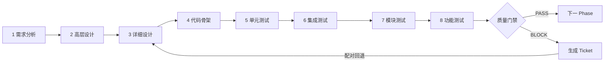

# 软件工厂（Software Factory）项目架构文档

| 项目 | 内容 |
|---|---|
| 文档名称 | 软件工厂自动化系统 —— 项目架构文档 |
| 系统代号 | Software Factory（软件工厂） |
| 文档版本 | v1.4 |
| 文档状态 | 架构基线（Architecture Baseline） |
| 内容来源 | DeepSeek 分享对话《来自分享的对话》
| 适用范围 | 系统设计、模块拆分、编码实现、评审与验收 |

> **来源与说明**
> 1. 本文档的主体内容（三层划分、五个车间、系统清单、系统间关系、数据流、依赖矩阵、目录结构与迭代路径）来自上述分享对话的四轮讨论，并按其内在逻辑重新组织为可执行的架构基线。
> 2. 对话原文中标注 `[reference:N]` 的外部实现引用，已统一整理为第 12 章《参考实现索引》。
> 3. 文中带 **〔工程细化〕** 标记的小节（状态机、接口签名、目录落位等）是架构师为便于落地而对原始设计所做的具体化，不改变原始设计的结论。
> 4. **v1.1 修订**：第 9 章（目录结构）、第 11.1 节（平台契约）、第 11.2 节（内部接口）原描述的设计方案未落地，已按实际实现重写；新增第 18 章记录核验结果与尚未消除的缺口。

---

## 目录

1. [项目概述](#1-项目概述)
2. [总体架构：控制面 / 正确面 / 数据面](#2-总体架构控制面--正确面--数据面)
3. [控制面详细设计](#3-控制面详细设计)
4. [正确面详细设计](#4-正确面详细设计)
5. [数据面详细设计](#5-数据面详细设计)
6. [系统间关系](#6-系统间关系)
7. [核心流程与状态机](#7-核心流程与状态机)
8. [领域对象模型](#8-领域对象模型)
9. [代码目录结构与模块划分](#9-代码目录结构与模块划分)
10. [技术选型与部署形态](#10-技术选型与部署形态)
11. [接口契约](#11-接口契约)
12. [参考实现索引](#12-参考实现索引)
13. [非功能性设计](#13-非功能性设计)
14. [实施路线图](#14-实施路线图)
15. [风险与对策](#15-风险与对策)
16. [附录：术语表](#16-附录术语表)
17. [过程发现：门禁的度量与修订](#17-过程发现门禁的度量与修订)
18. [架构符合性核验](#18-架构符合性核验v11-新增)

*（v1.2 在 11.3 节新增「跨模块调用契约：双向设计」）*

---

## 1. 项目概述

### 1.1 背景与目标

本项目的目标是构建一个**软件工厂**：一个自动化流水线系统，把目标平台给出的**大型需求文档**（YAML/DSL + 多模态参考图）编译为**可靠可运行的 GitHub 风格 ERP 与电子表格应用**。

它要解决的核心问题不是"能不能生成代码"，而是**"生成的代码是否被证明是对的，以及这个过程是否可追溯、可复现、可控制成本"**。

系统要同时交付三样东西：

| 交付物 | 含义 |
|---|---|
| **应用代码** | 最终可运行的前端 + 后端 + 数据库应用 |
| **生产轨迹** | 需求追溯矩阵、任务 DAG、Git 历史、决策日志、成本日志 |
| **运行结果** | 全量测试报告、外部验证测试结果、构建产物 |

### 1.2 系统定位

**本系统本身是一个软件，不是平台。** 平台（Runner）负责提供需求、注入密钥、在指定目录接收产物；软件工厂负责把需求变成应用。

```text
┌──────────────────────────────────────────────────────────────┐
│                        评测平台 / Runner                      │
│   提供：需求文档（YAML/DSL + 参考图）、隐藏 validation test     │
│   接收：应用代码、生产轨迹、运行结果                            │
└───────────────────────────┬──────────────────────────────────┘
                            │ 环境变量 / 目录约定
                            ▼
┌──────────────────────────────────────────────────────────────┐
│                     软件工厂（本系统）                         │
│   main.py  ← 需求路径 / 输出路径 / API Key（环境变量注入）      │
│   执行完整流水线：解析 → 规划 → 生产 → 质检 → 集成交付          │
└───────────────────────────┬──────────────────────────────────┘
                            │
                            ▼
              平台指定输出目录（应用 + 制品 + 报告）
```

### 1.3 设计原则

1. **需求文档是唯一真理源**：所有权衡、分解、验收都以需求模型为准，不以对话记忆为准。
2. **控制面与正确面分离**：绝不把"生成"和"验证"混在同一个上下文里做。
3. **测试是唯一权威信号**：编译器诊断、lint 日志、测试结果、证明器义务/反例均为权威，系统**永不覆盖**这些信号，只根据反馈修复。
4. **小步提交，每步可验证**：任务必须小到单次可验证，每个 Step 完成即产生一个可回退的 commit。
5. **保持制品可追溯**：需求 → 接口 → 代码 → 测试的全链路映射必须完整可查。
6. **信息隔离保证独立性**：审查者看不到实现者的推理过程，避免"自己测自己"。
7. **成本是一等公民**：按任务分配预算，超预算降级或跳过，统一按人民币计价。

### 1.4 一句话概括

> **软件工厂 = 需求解析 → 任务分解 → 智能体生产 → 测试验证 → 集成交付，再加上状态、成本、治理、可观测性四个横向支撑。**

---

## 2. 总体架构：控制面 / 正确面 / 数据面

### 2.1 分层定义

这是最稳的拆法，它避免把"生成"和"验证"混在一起。

| 层级 | 职责 | 关键问题 |
|---|---|---|
| **控制面**（Control Plane） | 规划、调度、智能体编排、预算控制 | 下一步做什么？谁来做？花多少钱？ |
| **正确面**（Correctness Plane） | 测试、验证、环境真实性、质量门禁 | 做对了吗？能不能证明？ |
| **数据面**（Data Plane） | 需求模型、代码制品、测试结果、日志、追溯链 | 东西在哪？改了什么？为什么改？ |

**核心原则**：控制面可以灵活换模型、换策略；正确面必须稳定、可重复、权威。

### 2.2 各层系统组成

| 层 | 系统 |
|---|---|
| 控制面 | 1. 编排器 Orchestrator<br>2. 领域执行引擎 Domain Execution Engine<br>3. 任务分解器 Task Decomposer<br>4. 智能体池 Agent Pool<br>5. 成本与预算控制器 Budget Controller |
| 正确面 | 1. 测试生成器 Test Generator<br>2. 验证执行器 Validation Runner<br>3. 审查器 Reviewer<br>4. 环境真实性管理器 Environment Realism Manager<br>5. 质量门禁 Quality Gate |
| 数据面 | 1. 需求模型仓库 Requirement Model Repository<br>2. 统一对象模型 Unified Object Model<br>3. 追溯矩阵 Traceability Matrix<br>4. 审计日志 Audit Log<br>5. 检查点与版本管理 Checkpoint & Version Control<br>6. 制品与交付仓库 Artifact & Delivery Repository |

### 2.3 与已有实现的映射（架构选型依据）

这三层并非抽象概念，而是在 ARC、XCompiler、Foreman、Replio 等已有实现中都能找到对应的具体组件。

| 三层 | 核心职责 | ARC | XCompiler | Foreman | Replio |
|---|---|---|---|---|---|
| **控制面** | 规划、调度、智能体编排、预算 | 双向测试驱动循环（top-down 架构 + bottom-up 实现） | Runtime 为唯一入口，Phase Engine 驱动 V 模型，Ticket 驱动迭代 | Orchestrator 路由四个 Station，每个 Station 是独立 subagent | 三层编排：swarm / jobs / fleet |
| **正确面** | 测试、验证、门禁、环境真实性 | 每个接口配备可验证测试套件（unit/modular/integration），全链路追溯 | 每个 Phase 固定八个 Step，错误不能跳过门禁，必须形成 Ticket | Reviewer 独立于 Implementer，在不同 vendor 上运行 | 工具 gated by allow/ask/deny，session 日志完整可审计 |
| **数据面** | 需求模型、代码制品、测试结果、追溯链 | 需求 DSL → 模块化设计 → 代码，全链路 traceability | Project / Phase / Step / Ticket / Changelist / Checkpoint 统一对象模型 | Work item 从 GitHub/Linear 进入，产出 draft PR | Session 日志 append-only，本地优先，插件注册工具/类型/团队 |

**选型结论**：以 **XCompiler 的统一对象模型 + Phase/Step 门禁机制**为骨架，以 **ARC 的需求 DSL + 追溯矩阵 + 测试套件驱动**为正确面核心，以 **Foreman 的"固定顺序、不跳站、审查者独立"**为编排纪律，以 **Replio 的 append-only 审计与本地优先**为数据面底线。

### 2.4 全局架构图

```text
┌─────────────────────────────────────────────────────────────────────────────┐
│                              控制面                                          │
│  ┌──────────┐    ┌──────────────┐    ┌────────────┐    ┌──────────────┐     │
│  │ 编排器   │───→│ 领域执行引擎 │───→│ 任务分解器 │───→│  智能体池    │     │
│  │Orchestr. │    │Phase Engine  │    │Decomposer  │    │ Agent Pool   │     │
│  └────┬─────┘    └──────┬───────┘    └──────┬─────┘    └──────┬───────┘     │
│       │                 │                   │                 │             │
│       │         ┌───────┴───────┐           │                 │             │
│       └────────→│ 成本与预算控制器│←──────────┘                 │             │
│                 │Budget Controller│                            │             │
│                 └───────┬───────┘                             │             │
└─────────────────────────┼─────────────────────────────────────┼─────────────┘
                          │                                     │
                          ▼                                     ▼
┌─────────────────────────────────────────────────────────────────────────────┐
│                              正确面                                          │
│  ┌──────────────┐    ┌──────────────┐    ┌──────────────┐                   │
│  │ 测试生成器   │───→│ 验证执行器   │───→│  审查器      │                   │
│  │Test Generator│    │Validation Run│    │  Reviewer    │                   │
│  └──────┬───────┘    └──────┬───────┘    └──────┬───────┘                   │
│         │                   │                   │                           │
│         │           ┌───────┴───────┐           │                           │
│         └──────────→│  质量门禁     │←──────────┘                           │
│                     │ Quality Gate  │                                       │
│                     └───────┬───────┘                                       │
│                             │                                               │
│                     ┌───────┴────────────┐                                  │
│                     │环境真实性管理器   │                                  │
│                     │Environment Manager │                                  │
│                     └───────┬────────────┘                                  │
└─────────────────────────────┼───────────────────────────────────────────────┘
                              │
                              ▼
┌─────────────────────────────────────────────────────────────────────────────┐
│                              数据面                                          │
│  ┌──────────────┐    ┌──────────────┐    ┌──────────────┐                   │
│  │需求模型仓库  │    │统一对象模型  │    │ 追溯矩阵     │                   │
│  │Requirement   │    │Unified Object│    │Traceability  │                   │
│  │Repository    │    │Model         │    │Matrix        │                   │
│  └──────────────┘    └──────┬───────┘    └──────────────┘                   │
│                             │                                               │
│         ┌───────────────────┼───────────────────┐                           │
│         ▼                   ▼                   ▼                           │
│  ┌──────────────┐    ┌──────────────┐    ┌──────────────┐                   │
│  │ 审计日志     │    │检查点与版本  │    │制品与交付仓库│                   │
│  │ Audit Log    │    │Checkpoint    │    │Artifact Repo │                   │
│  └──────────────┘    └──────────────┘    └──────────────┘                   │
└─────────────────────────────────────────────────────────────────────────────┘
```

---

## 3. 控制面详细设计

> 控制面负责"**做什么、谁来做、按什么顺序做、花多少预算**"。

### 3.1 编排器（Orchestrator）

**职责**：作为整个工厂的唯一调度入口，管理任务生命周期，按依赖顺序派发工作。参考 Argus，控制面锚定整个 campaign 并调度工作，执行面执行单一有界任务，记录面存储不可变记录。

**核心设计**：

- **固定顺序路由**：参考 Argus 的角色分离设计，编排器将每个任务按 **Manager → Planner → Engineer → Reviewer** 的顺序路由：
  - Manager 负责承诺目标、路线和 campaign 阶段；
  - Planner 将当前状态分解为有界任务和依赖；
  - Engineer 执行修改和实验；
  - Reviewer 独立检查。
- **不跳站原则**：编排器**从不跳过任何一个角色**，也**从不自己做某个角色的工作**。
- **单任务串行**：调度器一次只分配一个任务，记录结果，只在干净的任务边界推进。
- **失败回退**：任务失败时生成 Ticket 并回退到配对阶段，**错误不能跳过门禁**。

**参考实现**：Argus 的 reviewed mission loop 算法定义了完整的编排循环——Manager 承诺目标，Planner 产出任务规格，Engineer 执行并产出结果，Reviewer 判定 `done / continue / blocked`。

**关键接口**：`submit_goal()`、`next_task()`、`advance()`、`rollback(ticket)`、`status()`。

---

### 3.2 领域执行引擎（Domain Execution Engine）

**职责**：驱动迭代式 V 模型，管理 Phase 和 Step 的生命周期。

**核心设计**：

- **Phase 即一次完整 V 模型迭代**：每个 Phase 包含八个 Step —— **需求分析 → 高层设计 → 详细设计 → 代码骨架 → 单元测试 → 集成测试 → 模块测试 → 功能测试**。每次迭代都是完整 V 模型。
- **Step 状态机**：每个 Step 包含输入输出、依赖、配对、KPI、尝试次数和状态，由 `DomainAttemptRunner` 执行。
- **两阶段规划**：
  - `build`：负责需求澄清、复杂度判断、Phase 总计划和当前 Phase 详细计划；
  - `run`：负责无普通聊天交互的自动执行，只在敏感操作时请求授权。
- **门禁不可跳过**：错误不能跳过门禁，必须形成 Ticket 并按**配对关系**回退（设计 Step 与实现 Step 配对，测试 Step 与代码 Step 配对）。

**参考实现**：XCompiler 的 `DomainExecutionEngine` 和 `DomainAttemptRunner` 封装了执行投影，确保每次迭代的状态可追踪。

---

### 3.3 任务分解器（Task Decomposer）

**职责**：将大需求拆解为可独立验证的小任务，构建任务 DAG。

**核心设计**：

- **递归 DFS 遍历**：ARC 采用递归深度优先搜索策略遍历需求图，管理每个需求节点的生命周期。
- **分层拆解**：每个需求节点拆解为 **UI 接口、API 接口、DB 访问接口**三层，每层接口立即配备对应测试套件。
- **Bounded Task 原则**：每个任务必须足够小，以至于可以在**一轮执行中完成并验证**。例如拆成"实现注册 API 的邮箱格式校验"，而不是"实现整个注册模块"。
- **依赖解析**：自动分析任务间依赖关系，生成有向无环图，无依赖任务可并行执行。

**参考实现**：ARC 的 Algorithm 1 以需求图 `G_r = (V_r, E_r)` 为输入，通过 DFS 遍历编排目标软件系统的构建。

**输入 / 输出**：需求模型 → 任务 DAG（含任务边界、依赖边、验收条件、预算建议）。

---

### 3.4 智能体池（Agent Pool）

**职责**：管理各角色智能体的生命周期、能力配置和调用路由。

**核心设计**：

- **角色清单**（至少六种）：

  | 角色 | 职责 | 建议模型档位 |
  |---|---|---|
  | **Planner** | 规划、任务分解、依赖判定 | 强模型 |
  | **Architect** | 生成骨架代码、接口定义 | 强模型 |
  | **TestGenerator** | 生成单元 / 集成 / E2E 测试 | 强模型 |
  | **Developer** | 在测试约束下填充业务代码 | 快速模型 |
  | **Reviewer** | 独立检查代码质量、测试覆盖、合规性 | 强模型（异构 vendor 优先） |
  | **Fixer** | 根据结构化失败反馈自动修复 | 快速模型 |

- **审查独立性**：Engineer 可以自审允许的低风险有界工作；但**垂直策略、阶段关闭任务或 Engineer 主动请求**时，必须由独立的 Reviewer 审查。
- **模型路由**：每个角色可配置不同模型——强模型用于 Planner 和 Architect，快速模型用于 Developer 和 Fixer，多模态模型用于需求图片分析。
- **上下文隔离**：每个子任务拥有独立上下文，避免长对话污染。参考 Argus 的 bounded mission 设计，长生命周期对象是 **campaign**，而非 provider transcript。
- **工作区管理**：`WorkspaceManager` 为每个任务创建隔离工作区（Git 分支、临时目录、Docker 沙箱）；`ContextManager` 管理子任务上下文。

**参考实现**：BOAD 框架将 SWE 智能体结构化为编排器协调的专门化子智能体，覆盖定位、编辑、验证等子任务，在 SWE-bench-Verified 上优于单智能体和手工设计的多智能体系统。

---

### 3.5 成本与预算控制器（Budget Controller）

**职责**：按任务分配预算，控制 token 消耗和模型调用成本。

**核心设计**：

- **预算分配**：为每个 Phase 和 Step 分配 token / 时间预算，超预算自动降级或跳过。
- **模型选择策略**：根据任务复杂度动态选择模型——简单任务用便宜模型，难任务用强模型，避免"杀鸡用牛刀"或"杀牛用鸡刀"。
- **成本追踪**：记录每次模型调用的 token 消耗和人民币成本，**统一按人民币计价**。
- **性价比计算**：核心指标为 **通过率 / 成本**；通过率低于阈值时不谈性价比。
- **与编排器联动**：超预算时通知编排器执行降级（换模型）或跳过（放弃低优先级任务）。

---

## 4. 正确面详细设计

> 正确面负责"**做对了吗、能证明吗、可以放行吗**"。

### 4.1 测试生成器（Test Generator）

**职责**：为每个接口生成单元测试、集成测试和端到端测试。

**核心设计**：

- **测试先行**：在任何应用逻辑编写之前，为每个接口立即生成对应测试套件，包括 GUI Tests、RESTful API Tests、Integration Tests 和 Unit Tests。
- **测试分层**：
  - 底层**单元测试**验证较底层接口；
  - 中间**集成测试**验证 API；
  - 顶层**端到端测试**从用户角度验证功能。
- **Training Test vs Validation Test**：
  - 训练测试用例用于约束智能体开发过程；
  - 验证测试用例用于最终评分；
  - 测试生成器**只生成 Training Test**，Validation Test 由平台提供且**不可见**。
- **Test-Aware 调试**：参考 TENET 的反思式精化工作流，LLM 智能体能更有效地利用测试执行信号来修正不正确的代码生成。

**参考实现**：ARC 的 Testable Architecture Construction 阶段为每个接口生成测试套件，确保代码生成被严格"门控"在预定义架构之内。

---

### 4.2 验证执行器（Validation Runner）

**职责**：运行测试套件，产出结构化验证结果。

**核心设计**：

- **沙箱执行**：在隔离环境中运行测试，确保环境一致性。
- **结构化失败反馈**：测试结果不是简单的 pass/fail，而是包含**失败用例、期望输出、实际输出、错误类型**等结构化信息，供智能体分析和修复。
- **门禁机制**：每个 Step 完成后必须通过质量门禁，错误不能跳过，必须形成 Ticket 并按配对关系回退。
- **KPI / QualityAssessment**：每个 Step 定义可量化门槛、观测值、容差和证据，判定结果由 **ProjectManager 角色独立做出**。
- **外部验证**：`ExternalTestRunner` 运行平台隐藏的 validation tests（本地模拟），确保满足平台标准。

**参考实现**：ByteDigger 定义了强制性的 phased、gate-enforced 构建管线，TDD 是强制的，失败的测试在实现前被独立验证，LLM 验证门禁位于 **RED 和 GREEN 之间且不可跳过**。

---

### 4.3 审查器（Reviewer）

**职责**：独立检查生成代码的质量、测试覆盖率和合规性。

**核心设计**：

- **信息隔离**：Reviewer **只能看到推送的分支和验收标准**，永远看不到 Implementer 的推理过程。
- **独立判定**：Reviewer 给出 `done / continue / blocked` 的判定，并附带有依据的下一步操作和保留状态编辑。
- **审查范围**：代码是否满足验收标准、测试覆盖是否充分、是否存在硬编码或边界遗漏。
- **多供应商审查**：参考 Foreman 的设计，Reviewer 可以在不同的 vendor 上运行，保证审查独立性。

---

### 4.4 环境真实性管理器（Environment Realism Manager）

**职责**：确保测试环境与真实运行环境一致，避免"在我的机器上能跑"问题。

**核心设计**：

- **沙箱隔离**：每个任务在独立沙箱中执行，参考 XCompiler 的 Workspace、Git、Sandbox 基础设施层。
- **环境模拟**：使用 Playwright 等工具进行端到端测试，确保生成的应用在真实浏览器环境中可运行。
- **Holdout 测试**：保留一组未参与训练的隐藏测试用例，用于最终评估，防止过拟合。

---

### 4.5 质量门禁（Quality Gate）

**职责**：作为放行决策点，决定是否允许进入下一阶段。

**核心设计**：

- **分阶段门禁**：每个 Step 有自己的质量门禁，**不通过不能进入下一 Step**。
- **门禁内容**：测试通过率、代码覆盖率、lint 检查、类型检查、安全扫描等。
- **人工确认门**：关键节点强制人工确认，参考 XCompiler 的两道强制确认门（任一未通过则不写 `plan.json`）。
- **与 Ticket 联动**：门禁不通过时自动生成 **Bug Ticket**，按配对关系回退到对应 Step。

**判定输出**：`PASS`（放行）/ `BLOCK`（阻止，需修复）/ `ROLLBACK`（回退到配对 Step）。

---

## 5. 数据面详细设计

> 数据面负责"**东西在哪、改了什么、为什么改**"。

### 5.1 需求模型仓库（Requirement Model Repository）

**职责**：持久化需求树、依赖图和验收场景。

**核心设计**：

- **DSL 需求文档**：需求文档用轻量级图结构 DSL 格式描述，包含需求 ID、描述、依赖关系和验收场景，作为**意图的"源代码"**。
- **多模态支持**：需求节点可包含文字描述和参考图片，由多模态模型提取 UI 风格、组件和布局信息。
- **需求图**：`G_r = (V_r, E_r)`，每个节点代表一个功能场景，边代表依赖关系。

**参考实现**：ARC 将多模态需求文档结构化为基于图的 DSL，捕获功能场景和视觉约束。

---

### 5.2 统一对象模型（Unified Object Model）

**职责**：定义所有持久化对象的结构和关系。这是**整个工厂的通信中枢**。

**核心设计**：

- **统一 Envelope**：每个持久化对象包含统一信封：

  | 字段 | 说明 |
  |---|---|
  | `id` | UUIDv7，全局唯一且不可变 |
  | `name` | 展示名，不参与关联 |
  | `objectType` | 对象类型 |
  | `projectId` | 所属项目 |
  | `schemaVersion` | 结构版本 |
  | `revision` | 修订号（乐观并发） |
  | `createdAt` / `updatedAt` | 时间戳 |

- **对象类型**：`Project`、`ProjectPlan`、`Phase`、`PhasePlan`、`Step`、`Ticket`、`KPI` / `QualityAssessment`、`Changelist`、`Checkpoint`、`Deliverable` / `Report`、`Log` / `AuditEvent`。
- **关系存储**：关系只保存 ID 或 `{ id, objectType }`。**父 ID 是权威关系**，子列表和反向依赖是可校验投影。
- **Ticket 系统**：Ticket 是工作、缺陷、增强和变更传导的**唯一工作载体**。Ticket 只在 Phase 内产生和消费；Phase 外部只能向 PM 提交问题、数据和现场。

**参考实现**：XCompiler 的统一对象模型是最完整的参考，每个对象都有不可变 ID，支持断点续跑和回滚。

---

### 5.3 追溯矩阵（Traceability Matrix）

**职责**：维护需求 → 设计 → 代码 → 测试的完整映射。

**核心设计**：

- **全链路追溯**：捕获特定场景与其对应测试和代码实现之间的链接，允许系统决定是否**复用、修改或创建新接口**。
- **智能资产复用**：追溯记录为生成系统提供蓝图，让开发者理解"代码为何存在"以及"如何与原始多模态意图关联"。
- **Spec-Driven 治理**：参考 Spec-Driven AI 框架，保持需求、规格、设计决策、组织标准、质量门禁和实现结果之间的系统性连接。

**参考实现**：ARC 的追溯记录捕获所有从需求到设计、测试和实现的来源；Spec-Driven AI 的 Pattern Manager 提供治理上下文层，管理默认、组织级和项目级标准，索引仓库和文档，验证对批准模式的遵循情况。

---

### 5.4 审计日志（Audit Log）

**职责**：记录每一步的决策、工具调用、模型调用和成本。

**核心设计**：

- **Append-Only**：日志只追加，不修改，保证不可篡改。
- **结构化事件**：`Log` / `AuditEvent` 包含 correlation / causation 的领域审计信息。
- **可观测性集成**：参考 AI-SDLC 可观测性语义约定——
  - 为每个 pipeline 阶段、每个 agent 任务、每次质量门禁评估定义 **span**；
  - 为自主级别定义 **gauge**；
  - 为门禁通过/失败定义 **counter**；
  - 为任务时长定义 **histogram**。
- **成本记录**：记录每次模型调用的 token 消耗和人民币成本。

---

### 5.5 检查点与版本管理（Checkpoint & Version Control）

**职责**：支持断点续跑、回滚和版本切换。

**核心设计**：

- **Checkpoint 对象**：不可变的对象快照引用和事件序号。
- **Git 集成**：每个 Step 完成后提交一个 commit，支持回退到任意历史版本。
- **可恢复工程状态**：以 Runtime 为唯一业务入口，所有持久化对象使用全局唯一 UUIDv7，支持恢复和审计。
- **回退与消融分析**：利用被记录的中间版本快速分析——智能体在哪一步出错、是 prompt 问题还是模型能力问题，进行**消融实验**。

**参考实现**：Anthropic 的长运行智能体 harness 模式包括 initializer、coding sessions、progress logs、git checkpoints 和 E2E testing。

---

### 5.6 制品与交付仓库（Artifact & Delivery Repository）

**职责**：存储代码、测试、截图、日志和最终交付物。

**核心设计**：

- **Deliverable / Report 对象**：记录交付路径、验收条件和阶段/项目报告。
- **Changelist 对象**：记录 Ticket 在某个 Step 的增量修改、commit 和验证证据。
- **可视化面板**：需求树状态（**绿 / 黄 / 红 / 白**）、接口 → 代码 → 测试的追溯关系、每个版本的 Preview 和 Git 历史。
- **最终交付**：**应用代码 + 生产轨迹 + 运行结果**三者都要提交。

**需求树颜色语义**：

| 颜色 | 含义 |
|---|---|
| 🟢 绿 | 已通过全部门禁，交付完成 |
| 🟡 黄 | 进行中 / 部分通过 |
| 🔴 红 | 门禁失败，存在未关闭 Ticket |
| ⚪ 白 | 尚未开始 |

---

## 6. 系统间关系

从**调用关系、数据流、依赖关系、约束关系**四个维度，把三层所有系统串联起来。

### 6.1 跨层调用关系

#### 6.1.1 控制面 → 正确面

| 调用方 | 被调用方 | 调用内容 | 触发条件 |
|---|---|---|---|
| 领域执行引擎 | 测试生成器 | 请求为当前 Step 生成测试套件 | 进入"测试生成"Step 时 |
| 领域执行引擎 | 验证执行器 | 请求运行当前 Step 的测试 | 进入"验证"Step 时 |
| 领域执行引擎 | 质量门禁 | 请求判定当前 Step 是否放行 | 所有测试运行完成后 |
| 编排器 | 审查器 | 请求对高风险任务进行独立审查 | 垂直策略或阶段关闭任务 |
| 智能体池 | 测试生成器 | TestGenerator 角色执行测试生成 | 被编排器分配任务后 |
| 智能体池 | 审查器 | Reviewer 角色执行独立审查 | 被编排器分配任务后 |
| 成本与预算控制器 | 验证执行器 | 查询测试运行的资源消耗 | 每次测试运行后 |

#### 6.1.2 正确面 → 控制面

| 调用方 | 被调用方 | 调用内容 | 触发条件 |
|---|---|---|---|
| 质量门禁 | 领域执行引擎 | 返回放行/阻止/回退决策 | 判定完成后 |
| 质量门禁 | 编排器 | 请求生成 Bug Ticket | 门禁不通过时 |
| 验证执行器 | 领域执行引擎 | 返回结构化失败反馈 | 测试运行完成后 |
| 审查器 | 编排器 | 返回 done/continue/blocked 判定 | 审查完成后 |
| 环境真实性管理器 | 验证执行器 | 提供沙箱环境和运行配置 | 验证执行前 |

#### 6.1.3 控制面 → 数据面

| 调用方 | 被调用方 | 调用内容 | 触发条件 |
|---|---|---|---|
| 任务分解器 | 需求模型仓库 | 读取需求树，写入任务 DAG | 每次分解时 |
| 编排器 | 统一对象模型 | 创建/更新 Phase、Step、Ticket | 每次状态变更时 |
| 编排器 | 检查点与版本管理 | 创建 Checkpoint，提交 Git commit | 每个 Step 完成后 |
| 智能体池 | 统一对象模型 | 写入 Changelist、Log/AuditEvent | 每次智能体执行后 |
| 成本与预算控制器 | 审计日志 | 写入 token 消耗和人民币成本 | 每次模型调用后 |

#### 6.1.4 正确面 → 数据面

| 调用方 | 被调用方 | 调用内容 | 触发条件 |
|---|---|---|---|
| 测试生成器 | 统一对象模型 | 写入测试用例对象 | 测试生成后 |
| 验证执行器 | 统一对象模型 | 写入测试结果、失败详情 | 测试运行后 |
| 验证执行器 | 制品与交付仓库 | 写入测试报告、截图 | 验证完成后 |
| 审查器 | 审计日志 | 写入审查意见和判定依据 | 审查完成后 |
| 质量门禁 | 统一对象模型 | 写入 QualityAssessment、KPI | 判定完成后 |

#### 6.1.5 数据面 → 控制面

| 调用方 | 被调用方 | 调用内容 | 触发条件 |
|---|---|---|---|
| 需求模型仓库 | 任务分解器 | 提供需求树、依赖图、验收场景 | 任务分解启动时 |
| 统一对象模型 | 编排器 | 提供当前 Phase/Step/Ticket 状态 | 每次调度决策前 |
| 检查点与版本管理 | 编排器 | 提供可回退的 Checkpoint 列表 | 需要回退时 |
| 追溯矩阵 | 任务分解器 | 提供需求→接口→代码的历史映射 | 判断复用/新建时 |
| 审计日志 | 成本与预算控制器 | 提供历史成本数据 | 预算分配时 |

#### 6.1.6 数据面 → 正确面

| 调用方 | 被调用方 | 调用内容 | 触发条件 |
|---|---|---|---|
| 统一对象模型 | 验证执行器 | 提供测试用例、验收标准 | 验证执行前 |
| 制品与交付仓库 | 验证执行器 | 提供待验证的应用代码 | 验证执行前 |
| 追溯矩阵 | 审查器 | 提供需求→代码→测试的追溯链 | 审查时 |
| 检查点与版本管理 | 审查器 | 提供分支和 commit 信息 | 审查时 |

### 6.2 层内系统关系

#### 6.2.1 控制面内部

```text
编排器 ←──────────────────────────────────────────────┐
  │                                                        │
  │ 1. 创建 Phase，分配 Step                              │
  ▼                                                        │
领域执行引擎 ──────────────────────────────────────────┐  │
  │                                                        │  │
  │ 2. 请求分解需求                                       │  │
  ▼                                                        │  │
任务分解器 ────────────────────────────────────────────┐  │  │
  │                                                        │  │  │
  │ 3. 生成任务 DAG                                       │  │  │
  ▼                                                        │  │  │
智能体池 ←────────────────────────────────────────────┘  │  │
  │                                                        │  │
  │ 4. 查询预算，选择模型                                 │  │
  ▼                                                        │  │
成本与预算控制器 ────────────────────────────────────────┘  │
  │                                                        │
  │ 5. 返回预算约束                                       │
  └────────────────────────────────────────────────────────┘
```

**关键关系**：

- **编排器 → 领域执行引擎**：编排器创建 Phase，领域执行引擎管理 Phase 内 Step 的生命周期。
- **领域执行引擎 → 任务分解器**：领域执行引擎请求分解当前 Phase 的需求，任务分解器返回任务 DAG。
- **任务分解器 → 智能体池**：任务 DAG 中的每个任务被分配给智能体池中对应角色。
- **智能体池 → 成本与预算控制器**：智能体池在执行前查询预算，选择合适模型。
- **成本与预算控制器 → 编排器**：超预算时通知编排器降级或跳过任务。

#### 6.2.2 正确面内部

```text
测试生成器 ──────────────────────────────────────────┐
  │                                                      │
  │ 1. 生成测试套件                                      │
  ▼                                                      │
验证执行器 ──────────────────────────────────────────┐  │
  │                                                      │  │
  │ 2. 运行测试，产出结果                                │  │
  ▼                                                      │  │
质量门禁 ←──────────────────────────────────────────┘  │
  │                                                      │
  │ 3. 判定是否放行                                      │
  ▼                                                      │
审查器 ←──────────────────────────────────────────────┘
  │
  │ 4. 独立审查，返回判定
  ▼
环境真实性管理器 ──────────────────────────────────────┐
  │                                                      │
  │ 5. 提供沙箱环境，确保环境一致                        │
  └──────────────────────────────────────────────────────┘
```

**关键关系**：

- **测试生成器 → 验证执行器**：测试生成器产出测试套件，验证执行器负责运行。
- **验证执行器 → 质量门禁**：验证执行器返回结构化结果，质量门禁据此判定。
- **质量门禁 → 审查器**：门禁不通过或高风险任务时，触发独立审查。
- **环境真实性管理器 → 验证执行器**：提供隔离沙箱和真实运行环境。
- **审查器 → 质量门禁**：审查结论作为门禁的补充输入，影响最终放行决策。

#### 6.2.3 数据面内部

```text
需求模型仓库 ────────────────────────────────────────┐
  │                                                      │
  │ 1. 提供需求树                                        │
  ▼                                                      │
统一对象模型 ←──────────────────────────────────────┐  │
  │                                                      │  │
  │ 2. 提供对象状态                                      │  │
  ▼                                                      │  │
追溯矩阵 ←──────────────────────────────────────────┘  │
  │                                                      │
  │ 3. 提供追溯链                                        │
  ▼                                                      │
审计日志 ←──────────────────────────────────────────┘
  │
  │ 4. 记录事件
  ▼
检查点与版本管理 ────────────────────────────────────┐
  │                                                      │
  │ 5. 创建快照                                          │
  ▼                                                      │
制品与交付仓库 ←──────────────────────────────────────┘
```

**关键关系**：

- **需求模型仓库 → 统一对象模型**：需求树作为对象模型的输入，生成 Project / Phase / Step 对象。
- **统一对象模型 → 追溯矩阵**：每次对象变更更新追溯矩阵。
- **统一对象模型 → 审计日志**：每次状态变更写入审计事件。
- **统一对象模型 → 检查点**：每个 Step 完成后创建 Checkpoint。
- **检查点 → 制品与交付仓库**：Checkpoint 引用制品，制品仓库存储实际文件。

### 6.3 系统间依赖矩阵

| 系统 | 依赖 | 被依赖 | 关键接口 |
|---|---|---|---|
| 编排器 | 领域执行引擎、智能体池、成本控制器 | 所有系统 | 任务分配、状态查询 |
| 领域执行引擎 | 任务分解器、测试生成器、验证执行器、质量门禁 | 编排器 | Phase/Step 生命周期 |
| 任务分解器 | 需求模型仓库、追溯矩阵 | 领域执行引擎 | 需求树 → 任务 DAG |
| 智能体池 | 成本控制器、统一对象模型 | 编排器、领域执行引擎 | 角色执行、模型调用 |
| 成本控制器 | 审计日志 | 编排器、智能体池 | 预算分配、成本查询 |
| 测试生成器 | 统一对象模型、需求模型仓库 | 验证执行器 | 生成测试套件 |
| 验证执行器 | 环境真实性管理器、制品仓库 | 质量门禁 | 运行测试、返回结果 |
| 审查器 | 追溯矩阵、检查点 | 质量门禁 | 独立审查、返回判定 |
| 环境真实性管理器 | 无（基础设施层） | 验证执行器 | 沙箱、环境配置 |
| 质量门禁 | 验证执行器、审查器 | 领域执行引擎 | 放行/阻止/回退 |
| 需求模型仓库 | 无（基础数据层） | 任务分解器、测试生成器 | 需求树查询 |
| 统一对象模型 | 无（核心数据层） | 所有系统 | 对象 CRUD |
| 追溯矩阵 | 统一对象模型 | 任务分解器、审查器 | 追溯链查询 |
| 审计日志 | 统一对象模型 | 成本控制器、审查器 | 事件写入/查询 |
| 检查点与版本管理 | 统一对象模型 | 编排器、审查器 | 快照/回退 |
| 制品与交付仓库 | 检查点 | 验证执行器、最终交付 | 制品存储/读取 |

**依赖结论**：`统一对象模型` 是全系统的**唯一核心依赖**，`环境真实性管理器` 与 `需求模型仓库` 是**基础设施/基础数据层**，不依赖任何上层系统。这一结构保证了系统可以自底向上构建和测试。

### 6.4 关键数据流路径

#### 6.4.1 需求到代码的主数据流

```text
需求文档（YAML/DSL + 图片）
    │
    ▼
[需求模型仓库] ──→ 需求树 G_r = (V_r, E_r)
    │
    ▼
[任务分解器] ──→ 任务 DAG
    │
    ▼
[领域执行引擎] ──→ Phase + Step 序列
    │
    ▼
[智能体池] ──→ Architect 生成骨架 → TestGenerator 生成测试 → Developer 填充代码
    │
    ▼
[统一对象模型] ──→ Changelist + 代码文件
    │
    ▼
[验证执行器] ──→ 测试结果
    │
    ▼
[质量门禁] ──→ 放行/回退
    │
    ▼
[制品与交付仓库] ──→ 最终应用 + 生产轨迹
```

#### 6.4.2 验证与反馈数据流（TDD 修复闭环）

```text
[测试生成器] ──→ Training Test 套件
    │
    ▼
[验证执行器] ──→ 运行测试 ──→ 结构化失败反馈
    │                              │
    │                              ▼
    │                    [领域执行引擎] ──→ 生成 Bug Ticket
    │                              │
    │                              ▼
    │                    [智能体池] ──→ Fixer 修复
    │                              │
    │                              ▼
    │                    [验证执行器] ──→ 重新运行测试
    │                              │
    │                              ▼
    └──────────────────────→ 循环直到通过或预算耗尽
```

#### 6.4.3 成本控制数据流

```text
[成本与预算控制器] ──→ 分配预算
    │
    ▼
[智能体池] ──→ 查询预算 ──→ 选择模型
    │
    ▼
[模型调用] ──→ 消耗 token
    │
    ▼
[审计日志] ──→ 记录消耗
    │
    ▼
[成本与预算控制器] ──→ 检查是否超预算
    │
    ├── 未超预算 → 继续
    └── 超预算 → 通知编排器降级/跳过
```

#### 6.4.4 回退与恢复数据流

```text
[编排器] ──→ 发现错误
    │
    ▼
[检查点与版本管理] ──→ 查询可用 Checkpoint
    │
    ▼
[统一对象模型] ──→ 恢复到指定 Checkpoint 的对象状态
    │
    ▼
[追溯矩阵] ──→ 更新追溯关系
    │
    ▼
[领域执行引擎] ──→ 从回退点重新执行
```

### 6.5 关系总结

三层各系统之间的关系可以用四句话概括：

1. **控制面驱动正确面**：编排器、领域执行引擎、智能体池决定"做什么、谁来做、按什么顺序做"，并调用正确面的测试生成、验证和审查能力。
2. **正确面约束控制面**：质量门禁、验证执行器、审查器返回的判定结果决定控制面能否继续推进，不通过则生成 Ticket 回退。
3. **数据面支撑所有面**：需求模型仓库、统一对象模型、追溯矩阵、审计日志、检查点、制品仓库为控制面提供状态和输入，为正确面提供测试用例和追溯链，为整个工厂提供可追溯、可回退、可审计的基础。
4. **三者通过统一对象模型通信**：所有系统之间的交互都通过统一对象模型中的对象（Project、Phase、Step、Ticket、Changelist、Checkpoint）和事件（Log/AuditEvent）进行，确保整个工厂的运行是一个**可调度、可验证、可追溯的闭环系统**。

---

## 7. 核心流程与状态机

> 本章为 **〔工程细化〕**，用于把第 3~6 章的设计落实为可实现的控制流。

### 7.1 端到端运行时序

```text
需求输入 → 解析 → 规划 → 初始化工作区
   → ┌──────────────────────────────────────────────┐
     │ 循环：任务调度 → 智能体执行 → 验证 → 反馈      │
     │        → 修复 → 提交 → 下一个任务              │
     └──────────────────────────────────────────────┘
   → 集成 → 最终验证 → 输出应用
```

**五阶段流水线（车间视角）**：

| # | 车间 | 输入 | 输出 | 核心组件 |
|---|---|---|---|---|
| 1 | 需求解析车间 | 需求文档（YAML/DSL + 多模态参考图） | 结构化需求模型（需求树 + 依赖图 + 验收场景） | `RequirementParser`、`RequirementGraph`、`MultimodalExtractor` |
| 2 | 规划与分解车间 | 需求模型 | 任务 DAG（每任务对应一个可验证小模块） | `Planner`、`TaskDecomposer`、`DependencyResolver`、`BudgetAllocator` |
| 3 | 生产车间 | 任务 DAG | 每个任务的代码、测试、提交记录 | `Orchestrator`、`AgentPool`、`WorkspaceManager`、`ContextManager`、`TDDLoop` |
| 4 | 质检车间 | 生成的应用、内部测试、外部验证测试 | 通过率、失败详情、质量评分 | `TestRunner`、`Validator`、`GateKeeper`、`ExternalTestRunner`、`CostTracker` |
| 5 | 集成与交付车间 | 各模块通过测试的代码 | 完整可运行的应用、最终验证报告、提交包 | `Integrator`、`Builder`、`Packager`、`ArtifactCollector` |

### 7.2 Phase 八步 V 模型与 Step 状态机

每个 Phase 是一次完整迭代，固定包含八个 Step：



**Step 状态机**：

```text
PENDING ──→ READY ──→ RUNNING ──→ VERIFYING ──→ PASSED
                         │            │
                         │            └──→ FAILED ──→ TICKETED ──→ (回退配对 Step)
                         └──→ ABORTED（预算耗尽 / 人工终止）
```

每个 Step 的元数据包含：**输入输出、依赖、配对、KPI、尝试次数、状态**。

**Phase 状态机**：`PLANNED → BUILDING → RUNNING → GATING → CLOSED`（异常分支 `TICKETED` / `ROLLED_BACK`）。

### 7.3 Ticket 生命周期

```text
OPEN ──→ ASSIGNED ──→ IN_PROGRESS ──→ RESOLVED ──→ VERIFIED ──→ CLOSED
                          │                  │
                          │                  └──→ REOPENED（验证未通过）
                          └──→ WONT_FIX（预算耗尽且优先级低于阈值）
```

**规则**：
- Ticket 只在 Phase 内产生和消费；
- Phase 外部只能向 PM（ProjectManager 角色）提交问题、数据和现场；
- 任何门禁失败都必须形成 Ticket，**不得静默跳过**。

### 7.4 TDD 修复循环（生产车间核心）

```text
生成测试（Red）
   → 运行测试，确认失败（验证测试本身有效）
   → 生成/修改实现（Green）
   → 运行测试
   → 分析结构化失败反馈
   → Fixer 修复
   → 重新运行
   → 直到通过 或 预算耗尽 或 达到最大尝试次数
```

**关键约束**：LLM 验证门禁位于 **RED 和 GREEN 之间且不可跳过**——即在实现之前，必须独立验证失败测试确实是有效的失败（而非环境或测试自身错误）。

### 7.5 三层协作示例："实现注册 API"

**控制面**：

1. Orchestrator 从需求树取出"注册 API"节点，创建一个 Phase。
2. Phase Engine 生成八个 Step，Planner 分配任务：Architect 生成接口定义，TestGenerator 生成测试套件，Developer 填充业务代码。
3. 如果测试失败，Fixer 根据反馈修复，修复轮次有预算上限。

**正确面**：

4. TestGenerator 生成的测试运行，失败反馈结构化返回。
5. 内部测试通过后，运行外部验证测试（validation test），检查是否满足平台标准。
6. Reviewer 独立审查代码和测试，确认没有硬编码和边界遗漏。
7. 所有测试通过后，GateKeeper 放行，进入下一个需求节点。

**数据面**：

8. 每次变更生成一个 Changelist，记录修改的文件、commit 和验证证据。
9. 追溯矩阵更新：注册 API 节点 → 接口定义 → 代码文件 → 测试用例。
10. 审计日志记录每次模型调用的 token 消耗和人民币成本。
11. 如果后续需要回退，可以切换到任意 Checkpoint，恢复当时的对象状态。

---

## 8. 领域对象模型

### 8.1 对象清单

| 对象 | 职责 | 关键字段 |
|---|---|---|
| `Project` | 一次完整交付 | 需求源、交付路径、状态 |
| `ProjectPlan` | 项目级计划 | Phase 列表、预算总量 |
| `Phase` | 一次完整 V 模型迭代 | 关联需求节点、八个 Step、状态 |
| `PhasePlan` | 当前 Phase 详细计划 | Step 展开、依赖、KPI |
| `Step` | 最小可验证工作单元 | 输入输出、依赖、配对、KPI、尝试次数、状态 |
| `Ticket` | 唯一工作载体 | 类型（Bug/Enhancement/Change）、配对 Step、状态 |
| `KPI` / `QualityAssessment` | 量化门槛与证据 | 门槛值、观测值、容差、证据、判定 |
| `Changelist` | 增量修改记录 | 修改文件、commit、验证证据 |
| `Checkpoint` | 不可变快照 | 对象快照引用、事件序号 |
| `Deliverable` / `Report` | 交付物与报告 | 交付路径、验收条件、阶段/项目报告 |
| `Log` / `AuditEvent` | 审计事件 | correlation / causation、成本、耗时 |

### 8.2 关系规则

- 所有关系只保存 `id` 或 `{ id, objectType }`；
- **父 ID 是权威关系**，子列表和反向依赖是**可校验投影**，可随时重建；
- 每个对象 `id` 为 UUIDv7，**全局唯一且不可变**；
- 每次变更递增 `revision`，支持乐观并发与恢复。

### 8.3 关系示意

```text
Project ──1:N──→ Phase ──1:N──→ Step ──1:N──→ Changelist
                    │               │
                    │               ├──N:1──→ Ticket（配对回退）
                    │               └──1:1──→ KPI / QualityAssessment
                    │
                    ├──N:1──→ Checkpoint
                    └──1:N──→ Deliverable / Report

全局：Log / AuditEvent  ──关联──→  以上任意对象（append-only）
```

---

## 9. 代码目录结构与模块划分

> **本章于 v1.1 重写。** 原版描述的是九包分层结构（`orchestrator/` `planner/` `agents/`
> `verification/` `integration/` `requirements/` `artifacts/` `config/` `workspace/`），
> 该结构**在设计阶段被有意放弃**：本期实现以「最小可用闭环」为目标，
> 按**职责扁平化**为 13 个模块。原版目录与实现零对应，按它检索代码会一无所获
> —— 详见第 18 章《架构符合性核验》的 A 维度记录。

### 9.1 实际目录结构

```text
<repo>/
├── main.py                      # 边界：平台 Runner 契约入口（CLI）
└── factory/                     # 扁平模块，无子包
    ├── __init__.py
    ├── pipeline.py              # 控制面：端到端编排（run_factory）
    ├── loop.py                  # 控制面+正确面：TDD 修复循环 + 质量门禁
    ├── generator.py             # 控制面：智能体池（四角色 Protocol + LLM/Stub 实现）
    ├── config.py                # 横向：运行配置、模型路由、预算相关开关
    ├── llm.py                   # 横向：模型客户端 + 成本记账（CallStats）
    ├── adapter.py               # 数据面：需求适配/建模 + 拓扑排序
    ├── models.py                # 数据面：统一对象模型（Requirement/RunReport/…）
    ├── store.py                 # 数据面：追溯矩阵、审计日志、Git 检查点
    ├── workspace.py             # 控制面+正确面：工作区隔离、制品落盘
    ├── testplan.py              # 正确面：测试计划、基线守卫
    ├── testaudit.py             # 正确面：验证执行器（import/依赖/mock/注入旁路审计）
    ├── testrunner.py            # 正确面：测试运行器（vitest / node:test）
    └── version.py               # 横向：代码版本锚点（HEAD + 脏文件数 -> 测量可信度）
```

### 9.2 模块 → 架构层映射 **〔工程细化〕**

| 模块 | 所属层 | 对应系统 |
|---|---|---|
| `pipeline.py` | 控制面 | 编排器、领域执行引擎 |
| `loop.py` | 控制面 + 正确面 | TDD 修复循环、质量门禁、弱化守卫 |
| `generator.py` | 控制面 | 智能体池（设计 / 计划 / 写测试 / 实现四角色） |
| `llm.py` | 横向 | 模型路由层、成本记录 |
| `config.py` | 横向 | 模型路由层、预算策略 |
| `adapter.py` | 数据面 | 需求模型仓库（解析与建模）、需求图与拓扑排序 |
| `models.py` | 数据面 | 统一对象模型 |
| `store.py` | 数据面 | 追溯矩阵、审计日志、检查点 |
| `workspace.py` | 控制面 + 正确面 | 工作区隔离、上下文管理、制品落盘 |
| `testplan.py` | 正确面 | 测试生成（计划）、基线守卫 |
| `testaudit.py` | 正确面 | 验证执行器（审计部分） |
| `testrunner.py` | 正确面 | 验证执行器（执行部分） |
| `version.py` | 横向 | 代码版本锚点（HEAD / 脏文件数）、测量可信度标注 |
| `main.py` | 边界 | 平台 Runner 契约入口 |

### 9.3 与设计目标的差距

扁平化保留了三个面的职责划分（每个模块都能归入控制面 / 正确面 / 数据面 / 横向），
但以下设计目标**未实现**，不应按本章目录去寻找：

| 原设计目录 | 状态 | 说明 |
|---|---|---|
| `planner/dag.py` | 部分 | 有拓扑排序（`adapter._topological_order`），**无任务 DAG 分解与调度器** |
| `agents/*` | 形式不同 | 四角色由 `Generator` Protocol 表达，不是五个独立 agent 文件 |
| `workspace/sandbox.py` | 未实现 | 无 Docker 沙箱；隔离靠输出目录与 Git |
| `integration/` | 并入 | 集成与打包并入 `pipeline.py` + `workspace.py` |
| `artifacts/cost_tracker.py` | 并入 | 成本记录并入 `llm.py` 的 `CallStats` |
| `requirements/multimodal.py` | 未实现 | 无多模态需求分析 |
| `config/*.yaml` | 形式不同 | 配置走 `config.py` + 环境变量，无 YAML 配置文件 |

**保留的设计意图**：三面划分、门禁不可跳过、测试为唯一权威信号、
每个 Step 一个 Git commit、本地优先。这些在扁平结构下全部成立。

---

## 10. 技术选型与部署形态

| 领域 | 建议方案 |
|---|---|
| 主语言 | Python（AI 生态最全）或 TypeScript（前后端统一） |
| 编排框架 | LangGraph / CrewAI / AutoGen，或按本架构自研（推荐自研以严格实现门禁语义） |
| 沙箱隔离 | Docker（每任务独立容器） |
| 版本控制 | Git 命令 / GitPython（每 Step 一个 commit） |
| 测试 | pytest（后端）、Jest（前端）、Playwright（E2E） |
| 电子表格公式引擎 | Univer / Bilig（对应电子表格类需求） |
| 需求 DSL | YAML |
| 状态持久化 | JSON + SQLite + Git（推荐组合） |
| 模型接入 | 统一模型路由层，API Key 通过**环境变量注入**，绝不硬编码 |
| 可观测性 | 结构化日志 + span/gauge/counter/histogram 指标 + 简单 Web 面板或插件 |

**部署形态**：单进程可执行（`main.py`）优先，支持容器化；所有状态落本地磁盘（本地优先，不依赖外部服务），以保证可审计与可复现。

---

## 11. 接口契约

### 11.1 平台 Runner 契约

> **本节于 v1.1 修正。** 原版描述的是「全部通过环境变量传入」的一套五变量方案
> （`REQUIREMENT_PATH` / `OUTPUT_PATH` / `API_KEY` / `BUDGET_LIMIT` / `VALIDATION_TEST_PATH`），
> **该方案从未落地**。实际契约是 **ARC-Bench Agent Starter 模板定义的命令行形式**，
> 也是平台 Runner 真正调用的形式。原版描述与实现矛盾，按它对接平台会调不通。

**实际契约（命令行）**：

```bash
python3 main.py <req_dir> --output-dir <out> --type web
```

| 参数 | 含义 | 必需 |
|---|---|---|
| `<req_dir>` | 需求目录（位置参数），内含 `requirements.yaml` 与可选 `fixtures/` | 是 |
| `--output-dir <out>` | 应用与制品输出目录（平台指定） | 是 |
| `--type web` | 目标应用类型 | 是 |
| `--generator {auto,llm,stub}` | 生成器选择；`auto` 为默认 | 否 |
| `--install-deps {auto,never}` | 是否安装后端 npm 依赖 | 否 |
| `--test-dialect {auto,vitest,node}` | 测试方言；`auto` 为默认 | 否 |
| `--max-repairs N` | 每个需求的最大实现修复轮次 | 否 |
| `--requirements-file NAME` | 显式指定需求文件名 | 否 |
| `--dry-run` / `--quiet` | 只解析入库 / 降低日志级别 | 否 |

**Runner 注入的环境变量**（仅模型凭据，不是路径契约）：

| 环境变量 | 含义 |
|---|---|
| `OPENAI_API_KEY` | 模型访问密钥 —— **不入库、不落盘明文**（第 13.1 章约束） |
| `OPENAI_BASE_URL` | 模型网关地址 |
| `MODEL` | 模型名 |

**执行语义**：Runner 注入模型凭据 → 调用 `main.py <req_dir> --output-dir <out> --type web`
→ 工厂执行完整流水线 → 应用输出到 `<out>`，运行报告写入 `<out>/.arc/factory-report.json`
→ 返回退出码（0 成功 / 非 0 失败，见第 7 章状态机）。

**退出码语义**：`0` = 全部需求通过且无空转测试；非 `0` = 存在失败、空转或上游失败跳过。

**未落地的原方案**：`BUDGET_LIMIT`（总预算上限）与 `VALIDATION_TEST_PATH`（外部验证测试）
在本期实现中**不存在**——预算只有事后记账（`CallStats`），没有事前限额；
外部验证测试未接入，验证只依赖工厂自己生成的测试。

### 11.2 内部核心接口 **〔工程细化〕**

> **本节于 v1.1 修正。** 原版列出的 15 个接口名中，**只有 1 个（`snapshot`）在实现里同名存在，且含义不同**。
> 下表改为「**设计接口 → 实现对应**」两栏对照：名称不同但职责多可对应；
> 确实没有实现的单独标注为**缺口**。
> 判定依据见第 18 章《架构符合性核验》的 C 维度。

| 系统 | 设计接口 | 实现中的对应 | 状态 |
|---|---|---|---|
| 编排器 | `submit_goal(goal) -> Project` | `pipeline.run_factory(runtime, req_dir, out_dir, ...)` | 职责对应 |
| 编排器 | `next_task() -> Task \| None` | `adapter._topological_order()` + `pipeline` 逐需求循环 | 职责对应（**无 DAG，仅拓扑序**） |
| 领域执行引擎 | `run_phase(phase) -> PhaseResult` | `loop.TddLoop.run(requirement)` | 职责对应（**无八步 V 模型**，为 RED→实现→GREEN 三阶段） |
| 领域执行引擎 | `attempt_step(step) -> StepResult` | `TddLoop.run()` 内的阶段推进 | 职责对应 |
| 任务分解器 | `decompose(node) -> DAG` | —（只有拓扑排序，无 DAG 分解） | **缺口** |
| 智能体池 | `dispatch(role, brief) -> AgentResult` | `generator.Generator` Protocol：`design` / `plan_tests` / `write_tests` / `implement` | 职责对应（四角色，无独立会话隔离） |
| 成本控制器 | `reserve(task) -> Budget` | —（**无预算预留**） | **缺口** |
| 成本控制器 | `settle(task, usage)` | `llm.CallStats.snapshot()` / `delta()`——事后结算 | 职责对应 |
| 测试生成器 | `generate_tests(interface) -> TestSuite` | `generator.LLMGenerator.plan_tests()` + `write_tests()` | 职责对应 |
| 验证执行器 | `run(suite) -> StructuredResult` | `testrunner.TestRunner.run()` → `models.TestOutcome` | 职责对应（**无沙箱**，直接子进程执行） |
| 审查器 | `review(branch, criteria) -> Verdict` | `loop._enforce_no_weakening()` / 依赖门禁 / mock 门禁 | 职责对应（审查内嵌于循环，非独立 reviewer） |
| 验证执行器（审计） | —（原设计未含） | `testaudit.audit_dependency_usage()` / `audit_mocked_dependencies()` / `audit_injection_bypass()` | **新增**（本期为堵「模块层空转」而加） |
| 质量门禁 | `evaluate(step, evidence) -> GateDecision` | `loop._is_weak()` / `_is_uncollectable()` / `_audit_dependencies()` 等 | 职责对应（返回 PASS/BLOCK，无 ROLLBACK 枚举） |
| 统一对象模型 | `create/get/update/list(...)` | `models.Requirement` / `RunReport` 等 dataclass + `adapter` 建模 | 部分（**无 CRUD 接口与乐观并发**） |
| 检查点 | `snapshot() -> Checkpoint` / `restore(id)` | `testplan.record_baseline()`（测试基线）；回归检查回退上一版实现 | 部分（**无通用检查点/回退**） |
| 审计日志 | `append(event)` / `query(filter)` | `store.FactoryStore.record_*` → `.arc/runner-events.jsonl` | 写对应，**查询缺口** |
| 追溯矩阵 | `link(req, iface, code, test) / trace(id)` | `store` 写入 `.arc/traceability/*.json`（7 张表） | 写对应，**`trace` 查询缺口** |

**设计要点（保留）**：`dispatch(role, brief)` 必须创建**全新会话**，不继承调用方任何上下文
—— 这是 Foreman 式隔离的实现基础。**本期实现未做到这一点**：
四角色共享同一个 `ModelClient`，上下文通过提示词传递。这是与设计目标的重要差距。

**明确的功能缺口汇总**：`decompose`（任务 DAG）、`reserve`（预算预留）、
`trace`（追溯查询）、通用检查点与回退、独立 Reviewer、Docker 沙箱。

### 11.3 跨模块调用契约：**双向**设计 **〔v1.2 新增〕**

**决策**：契约不是下游单向声明，而是从全量需求集**推导**出来的双向关系。

```yaml
# 下游声明（唯一的 YAML 入口）
- id: REQ-11
  cross_module_calls:
    - upstream: REQ-7
      symbol: updateQuantity
      signature: "updateQuantity(sku, quantity, from, to)"
      semantics: "更新库存数量并写入一条流水记录"
      side_effects: ["记录流水到 movements 数组"]
```

适配层在解析完**全部**需求后，反向给上游填 `incoming_contracts`（非 YAML 字段）：

```
REQ-11 声明       →  REQ-11.cross_module_calls = [REQ-7/updateQuantity(4 参)]
                  →  REQ-7.incoming_contracts   = [REQ-7/updateQuantity(4 参)]   ← 推导
```

**理由：只做下游声明，契约在结构上无法满足。**

实测证据（closure6）：修复前 REQ-7 实现的是 `updateQuantity(sku, from, to)`
（3 参数、语义为「区间变更」），而下游声明要求 4 参数。
两个需求的单模块测试各自通过 —— REQ-7 测区间变更、REQ-11 测流水查询 ——
矛盾只在集成点出现。模型被告知「你没 import 上游」时，
**无法推断出正确的参数语义**：它只知道要调，不知道按什么调。

**推导而非新增字段的好处**：上游无需重复声明，契约天然双向一致；
若让上游也写一份，两份声明可能漂移，反而引入新的不一致源。

**注入点**：`generator._requirement_brief()` —— 它被设计/计划/写测试/实现
四个 prompt 共用，改一处即四处生效。

**门禁**：`testaudit.CONTRACT_MISMATCH`（仅在声明了 `cross_module_calls` 时校验；
未声明时全链路行为不变）。校验按**参数个数**比对。

**已知局限（须如实记录）**：同个数的**参数顺序错**静态检不出 ——
`foo(b, a, c)` 与 `foo(a, b, c)` 同为 3 参。
按名字比对不可靠（调用方使用自己作用域里的变量名，`foo(quantity, sku)` 未必是错的）。
因此签名校验的可靠边界是「个数」，不是「语义」。
见 `tests/test_contract_mismatch.py` 断言⑦（该局限被钉进断言，
将来若改为能检出，那条会失败并提醒更新本节）。

**验证状态**：closure6 全链通过那一轮 `CONTRACT_MISMATCH` 触发 **0 次** ——
提示词注入已足够，门禁未登场。所以另用合成用例
（`tests/test_contract_mismatch.py`，25 项断言）单独验证门禁本身可用。

---

## 12. 参考实现索引

分享对话中引用的已有实现，按对本项目的作用归类：

| 参考实现 | 借鉴要点 |
|---|---|
| **ARC** | 双向测试驱动循环（top-down 架构 + bottom-up 实现）；需求 DSL 与需求图 `G_r=(V_r,E_r)`；递归 DFS 遍历（Algorithm 1）；每个接口配备可验证测试套件；全链路追溯矩阵 |
| **XCompiler** | Runtime 为唯一业务入口；Phase Engine 驱动迭代式 V 模型；每个 Phase 固定八个 Step；统一对象模型与 envelope（UUIDv7）；Ticket 驱动迭代；门禁不可跳过；两道强制人工确认门；DomainExecutionEngine / DomainAttemptRunner |
| **Foreman（Vercel）** | Orchestrator 路由四个 Station（Classifier / Analyst / Implementer / Reviewer）；Station 为独立 subagent，拥有独立指令、模型、沙箱与工具；不跳站、不代劳；Reviewer 独立于 Implementer 且跨 vendor 运行；信息隔离 |
| **Replio** | 三层编排抽象 swarm / jobs / fleet；本地优先；append-only session 日志；插件注册工具/provider/命令/服务/agent 类型/团队/技能/eval fixture |
| **Argus** | 控制面锚定 campaign 并调度，执行面执行单一有界任务，记录面存储不可变记录；reviewed mission loop；Manager/Planner/Engineer/Reviewer 角色分离；bounded mission |
| **Autofy** | 工具信号权威化（lint 日志、编译器诊断、证明器义务/反例、测试结果永不覆盖）；快速失败保留预算；多版本流水线（contract 与 implementation 变体交叉组合） |
| **ByteDigger** | 强制 phased、gate-enforced 构建管线；TDD 强制；失败测试在实现前独立验证；LLM 验证门禁位于 RED 与 GREEN 之间且不可跳过 |
| **BOAD** | SWE 智能体结构化为编排器协调的专门化子智能体；覆盖定位、编辑、验证；SWE-bench-Verified 上优于单智能体 |
| **TENET** | 反思式精化工作流；利用测试执行信号修正不正确的代码生成 |
| **Anthropic 长运行 harness** | initializer、coding sessions、progress logs、git checkpoints、E2E testing |
| **Spec-Driven AI** | Pattern Manager 治理上下文层；默认/组织级/项目级标准；索引仓库与文档；验证对批准模式的遵循 |
| **AI-SDLC 可观测性语义约定** | pipeline 阶段/agent 任务/门禁评估定义 span；自主级别 gauge；门禁通过失败 counter；任务时长 histogram |

---

## 13. 非功能性设计

### 13.1 治理与安全

- **沙箱隔离**：禁止智能体访问敏感数据；每个任务独立沙箱。
- **密钥管理**：API Key 通过环境变量注入，**不硬编码、不入库、不落盘明文**。
- **代码审查门禁**：防止恶意或低质提交进入主干。
- **工具权限**：参考 Replio 的 `allow / ask / deny` 三级门控。

### 13.2 成本与预算

- 按任务分配预算，超预算自动降级（换便宜模型）或跳过。
- 模型选择策略：简单任务用便宜模型，难任务用强模型。
- 统一按人民币计价，记录每次调用明细。
- 核心指标：**通过率 / 成本**；通过率低于阈值时不谈性价比。

### 13.3 可观测性与可视化

- 需求树状态可视化：绿（通过）/ 黄（进行中）/ 红（失败）/ 白（未开始）。
- 接口 → 代码 → 测试的追溯关系可视化。
- 每个版本的 Preview 和 Git 历史。
- 分阶段 span、门禁 counter、任务时长 histogram、自主级别 gauge。

### 13.4 可恢复性与可复现性

- 支持断点续跑、回滚到任意 Git commit / Checkpoint。
- 所有持久化对象使用全局唯一 UUIDv7，支持恢复与审计。
- 利用被记录的中间版本做**消融分析**：定位智能体在哪一步出错、是 prompt 问题还是模型能力问题。

### 13.5 多智能体协作协议

- 明确定义角色、通信格式、任务交接标准。
- 审查者独立于实现者，避免"自己测自己"。
- 可用消息队列或简单的函数调用实现。

### 13.6 模型路由层

- 统一封装不同模型 API（DeepSeek、Kimi、Qwen 等）。
- 支持多模态模型用于需求图片分析。
- 记录每次调用的 token 和成本。

---

## 14. 实施路线图

### 14.1 总体迭代顺序（七步）

不要一上来就做全部。按此顺序迭代：

| # | 里程碑 | 交付内容 | 涉及的层 |
|---|---|---|---|
| 1 | **跑通单任务 TDD 循环** | 读一个简单需求 → 生成测试 → 实现 → 修复 → 通过 | 控制面仅需简单 Orchestrator；正确面仅内部测试；数据面仅记录 Changelist |
| 2 | **加入任务分解** | 需求树拆成多个模块，串行执行；加入 Phase Engine（每个需求节点一个 Phase，含完整八步） | 控制面 |
| 3 | **加入工作区隔离与 Ticket/门禁** | 每模块独立 Git 分支，支持回滚；测试不通过不能进入下一 Phase，错误形成 Ticket | 控制面 + 数据面 + 正确面 |
| 4 | **加入验证门禁与审查独立性** | 内部测试 + 外部验证测试，不通过不合并；Reviewer 与 Implementer 分离，独立判断 | 正确面 |
| 5 | **加入多智能体角色分离** | 架构师、测试、开发、审查、修复角色完全分离、上下文隔离 | 控制面 |
| 6 | **加入追溯矩阵、审计日志与成本控制** | 维护需求→代码→测试映射；记录每步决策与成本；按难度路由模型 | 数据面 + 控制面 |
| 7 | **优化并行与调度** | 无依赖任务并行执行，缩短总时长；加入可视化面板 | 控制面 + 数据面 |

### 14.2 落地优先级（浓缩版）

```text
MVP ─┬─ 1. 单任务 TDD 循环
     ├─ 2. Phase Engine（八步 V 模型）
     ├─ 3. Ticket + 门禁
     ├─ 4. 审查独立性
     ├─ 5. 追溯矩阵 + 审计日志
     └─ 6. 成本控制 + 模型路由
                                    → 产品化：并行调度 + 可视化面板
```

**贯穿始终的核心原则**：

> **控制面决定做什么和谁来做，正确面证明做对了，数据面记录做了什么和为什么。**

---

## 15. 风险与对策

| 风险 | 影响 | 对策 |
|---|---|---|
| 上下文污染导致长对话质量下降 | 生成质量不稳定 | 每个子任务独立上下文；长生命周期对象是 campaign 而非 transcript |
| 智能体"自己测自己" | 验证失效，缺陷漏出 | 审查者信息隔离，跨 vendor 运行；门禁不通过必须形成 Ticket |
| 测试造假或测试本身错误 | 假绿（false green） | LLM 验证门禁置于 RED 与 GREEN 之间不可跳过；测试在实现前独立验证 |
| 需求理解偏差 | 交付方向错误 | 需求文档为唯一真理源；两阶段规划（build 澄清 → run 自动执行）；关键节点人工确认门 |
| 成本失控 | 预算耗尽、任务中断 | 按 Phase/Step 分配预算；超预算降级或跳过；性价比 = 通过率/成本 |
| 过拟合到训练测试 | 隐藏用例失败 | 平台 Validation Test 不可见；保留 Holdout 测试集 |
| 无法定位失败原因 | 调试成本高 | 每 Step 一个 commit + Checkpoint；审计日志 append-only；支持消融分析 |
| 环境不一致 | "在我机器上能跑" | 沙箱隔离 + 真实环境模拟（Playwright）+ 环境真实性管理器 |
| 并行任务冲突 | 代码合并冲突、端口冲突 | 工作区隔离（分支/目录/容器）；fleet 式无冲突端口分配与健康检查 |

---

## 16. 附录：术语表

| 术语 | 释义 |
|---|---|
| **控制面 / 正确面 / 数据面** | 本架构的三层划分，分别回答"做什么谁来做花多少钱""做对了吗能否证明""东西在哪改了什么为什么改" |
| **Phase** | 一次完整的 V 模型迭代，包含固定的八个 Step |
| **Step** | 最小可验证工作单元，包含输入输出、依赖、配对、KPI、尝试次数与状态 |
| **配对（pairing）** | Step 之间的回退对应关系（如设计与实现配对），门禁失败时按配对回退 |
| **Ticket** | 工作、缺陷、增强和变更传导的唯一工作载体，只在 Phase 内产生和消费 |
| **Changelist** | 某个 Step 的增量修改记录，含修改文件、commit 与验证证据 |
| **Checkpoint** | 不可变的对象快照引用与事件序号，支持断点续跑与回滚 |
| **KPI / QualityAssessment** | 可量化门槛、观测值、容差与证据，构成门禁判定依据 |
| **Training Test / Validation Test** | 前者约束智能体开发过程（工厂自生成），后者由平台提供且不可见，用于最终评分 |
| **Bounded Task** | 足够小、可在一轮执行中完成并验证的任务 |
| **Holdout 测试** | 未参与训练、用于最终评估的隐藏测试用例 |
| **Red / Green** | TDD 的失败态与通过态；验证门禁位于两者之间且不可跳过 |
| **reviewed mission loop** | Argus 的编排循环：Manager 承诺目标 → Planner 产出任务规格 → Engineer 执行 → Reviewer 判定 |
| **Station** | Foreman 中编排器路由经过的独立 subagent 环节（Classifier / Analyst / Implementer / Reviewer） |
| **swarm / jobs / fleet** | Replio 的三层编排抽象：类型委托协作 / 定时持久工作流 / supervisor 管理多 agent |
| **统一 Envelope** | 所有持久化对象共有的字段集合（id、name、objectType、projectId、schemaVersion、revision、时间戳） |

---

## 17. 过程发现：门禁的度量与修订

> 本章不是设计推演，而是**实测后的修订记录**。它推翻并修正了第 4 章"质量门禁"与
> 第 7 章"TDD 修复循环"中的两处隐含假设。
> 原始证据：[EXPERIMENT.md](EXPERIMENT.md)（门禁漏洞发现）、[EXPERIMENT2.md](EXPERIMENT2.md)（A/C 修订实验）。

### 17.1 核心过程发现（本章最重要的一条）

> **光有白名单只能阻断，回传理由才能纠正。**

这是在修补 RED 门禁逃逸路径时实测出来的。逃逸路径本身是这样的：

```text
1. 写一个空转测试（在测试文件内自造 mock，不 import 实现）
2. 不去修它，而是另外新增一个会失败的测试文件
3. 整组跑当然失败 -> 门禁放行  ✅（而真正要修的文件原封不动）
4. 交付的测试套件里永久留着一个永远通过、什么也不证明的测试
```

第一版修补只做了"拒绝"：计划外的测试文件一律不写。结果是**模型连续两轮都试图新增
文件、连续两轮被拒，种子依然空转**（`拒绝新增=2`，严格口径 ✗）。

补上拒绝反馈闭环后（把 `UNAUTHORIZED_TEST_FILE` 违规项 + 计划内路径清单 +
"请在计划内文件里直接修复"回传给生成器），同一实验立刻变成 7/8 通过。

**这条经验可以推广到所有门禁设计**：门禁的价值不止于"拦住"，更在于
**把拒绝的理由变成下一步可执行的输入**。只拦不说的门禁，会让智能体在同一个
错误上反复重试，直到预算耗尽——现象上看起来像"模型不会修"，实质上是
"门禁没有把话说清楚"。

### 17.2 度量口径错误：一次被反例推翻的判定

原门禁的判定是"**这一组测试整体有没有失败**"。这个口径被一个反例推翻：
某次试验记录为"修复成功"，但那个种子文件单独跑是 4/4 全过——它仍然是空转的。

原因是模型新增了第二个文件，整组退出码非零，于是被判为成功。

修正后的严格口径要求三件事同时成立：

1. 种子文件仍然存在；
2. **单独运行种子文件**必须失败（RED）；
3. 种子文件必须引用了实现模块。

重算已有工作区（不重跑模型）：**16/16 的种子文件都还在，且都还是空的；
完成的 15 次重写 100% 选择了"新增一个测试文件"。**

> **教训**：门禁的判定对象必须是"每一条证据"，而不是"证据的集合"。
> 集合级判定存在"用一条真证据掩盖一条假证据"的结构性空间。

### 17.3 修订方案与被证伪的预测

**A（路径白名单）**：先产出 `test_plan.yaml`（见 schemas/test_plan.schema.yaml），
计划内的路径即白名单；写测试/重写只允许写这些路径；运行集合由计划派生，
不再由模型的输出决定。

**C（import 审计）**：`audit_imports()` 逐文件静态扫描 import/require 路径，
判断是否指向实现模块；`NO_IMPLEMENTATION_IMPORT` / `DYNAMIC_IMPORT` /
`ALIAS_UNRESOLVED` 一律判 `WEAK_TEST`。

修订后的判定：**整组通过 OR 任一文件未引用实现 → WEAK_TEST**。

三组对照实验（deepseek-v4-pro，诱导空转起点，每组 n=8）：

| 处理组 | 严格口径通过 | 静默假通过 | 拒绝新增文件 | 重写轮次 |
|---|---|---|---|---|
| 对照（无 A 无 C） | 0/8 | **8/8** | 0 | 8 |
| A 单独 | **7/8** | **0/8** | 7 | 15 |
| A + C | 7/8 | 0/8 | 7 | 15 |

**被证伪的两个预测**（同样值得记录）：

1. **"A+C 后重写轮次应下降"——错，实际从 8 升到 15。**
   模型第一轮**总是**先尝试新增文件（7/7 成功 trial 都恰好被拒 1 次），
   被拒后才转为原地修复。A 让每个需求多付一轮模型调用。
   **收益（静默假通过 8/8 → 0/8）必须大于这笔成本**，这个权衡必须写进账。

2. **"C 有独立增量"——测不出。** A 与 A+C 的 8 个 trial 逐条相同。
   一旦模型被迫修改计划内文件，它自然就会引用实现，C 不再额外触发。

### 17.4 C 的定位登记：它是诊断工具，不是检测器

C 保留为**纵深防御与诊断工具**，不作为卖点，也不宣称增量。

理由：它真正的价值在上一轮实验中已经体现——**正是审计才让"空转文件与正常文件并存"
这件事可见**。RED 门禁在原理上看不见它（整组失败是"真"的），
只有逐文件审计能暴露"其中一条证据是假的"。

这与 17.2 的教训是同一条：**判定对象必须是每一条证据。**

### 17.5 弱化守卫的判定标准

在 A 的基础上补一层守卫，防止模型把已经有效的测试改弱（只改断言、删断言、拆分文件）。
判定标准**复用 C 的审计产出**，不引入新检测器：

```text
有意义   = 单独跑时失败（RED） + import 了真实实现
无意义   = 单独跑通过         或  没有 import 实现

有意义的文件 -> 只允许追加/修改，不允许删除已有断言或用例
无意义的文件 -> 允许整体重写
```

**为什么必须用双信号**：空转文件的断言毫无价值，删掉它们正是我们想要的结果。
若只看"是否 import 实现"就一律保护，修复空转文件时会被守卫自己拦住。

### 17.6 成本记账：环境失败不能混进逻辑失败

门禁修订之后暴露出的新记账需求。网关的延迟方差极大（同一调用 36s ~ >600s，
且会直接断连），若把网关重试混进"重写轮次"，就会把**环境失败误判为逻辑失败**。

因此必须分开计数：

| 计数器 | 含义 |
|---|---|
| `token_consumed` | 每轮模型调用累计（prompt / completion / reasoning 分列） |
| `gateway_retries` | 网络错误、5xx/429、超时、服务端差异降级、空正文重试 |
| `rewrite_rounds` | 门禁判定触发的逻辑重写（与上面完全独立） |

实测中确有 trial 因网关断连而"失败"（`拒绝新增=0`、`重写=1`，说明重写调用根本没跑完）——
若不分开记账，这些会被错误地归因于模型能力。

### 17.7 对第 4 章与第 7 章的修订

| 章节 | 原表述 | 修订 |
|---|---|---|
| 4.5 质量门禁 | "每个 Step 有自己的质量门禁，不通过不能进入下一 Step" | 补充：**判定对象是每一条证据，不是证据的集合**；门禁必须回传可执行的拒绝理由 |
| 7.4 TDD 修复循环 | "生成测试 → 运行 → 分析失败 → 修复 → 直到通过" | 补充：循环的**起点必须有一份计划**（白名单来源）；"通过"必须逐文件判定 |
| 7.2 Step 状态机 | `WEAK_TEST` 仅作为标记 | `WEAK_TEST` 为**阻断态**，触发配对回退到写测试阶段，耗尽则需求 FAILED |

---

## 18. 架构符合性核验（v1.1 新增）

本章记录一次**全量文件核验**的结果：把工作区每个文件对照本架构文档的要求逐一核对。
核验可复现，工具为 `tools/audit_architecture.py`，输出 `architecture_audit.json`，
结论详见仓库根目录的 `ARCHITECTURE_AUDIT.md`。

### 18.1 核验维度与结果

| 维度 | 依据 | 符合 | 偏差 | 缺失 | 文档滞后 |
|---|---|---|---|---|---|
| A 目录结构 | 第 9 章 | 0 | 10 | 0 | — |
| B 平台契约 | 第 11.1 章 | 1 | 1 | 0 | — |
| C 内部接口 | 第 11.2 章 | 0 | 1 | 1 | — |
| D 模块→架构层归属 | 第 2 / 9.2 章 | **13** | 0 | 0 | — |
| E 数据面产物 | 第 5 章 | **11** | 0 | 0 | — |
| F 非功能性 | 第 10 / 13 章 | **4** | 0 | 0 | — |
| G 文档↔实现一致性 | 本章 | 0 | 0 | 0 | **1** |
| H 孤儿文件 | — | 0 | 2 | 0 | — |
| **合计** | | **29** | **14** | **1** | **1** |

### 18.2 核验发现（净结论）

**实现与三面架构在语义上自洽**：

- D 维度 **13/13**：13 个模块全部能归入控制面 / 正确面 / 数据面 / 横向，三个面都有落点
- E 维度 **11/11**：第 5 章要求的 10 类产物全部落盘且有数据，
  `req → iface → test → code` 追溯闭环成立
- F 维度 **4/4**：无硬编码密钥、本地优先、Git 检查点、凭据经环境变量注入

**文档与实现脱节**（本次修订的直接动因）：

- 第 9 章原描述的 9 个包目录在实现中**一个都不存在**；
  实际 13 个模块在文档中**零提及**（精确匹配 `X.py` / `factory/X`，12/12 未命中）
- 第 11.1 章的「环境变量契约」与平台 Runner 的实际调用方式矛盾
- 第 11.2 章的 15 个接口名仅 1 个同名存在

### 18.3 本次修订（v1.0 → v1.1）

| 章节 | 修订内容 |
|---|---|
| 第 9 章 | **重写**：改为实际扁平结构 + 模块→层映射 + 与设计目标的差距表 |
| 第 11.1 | **修正**：改为真实的 CLI 契约，原环境变量方案标注为未落地 |
| 第 11.2 | **修正**：改为「设计接口 → 实现对应」两栏对照，明确标出 5 类功能缺口 |
| 第 18 章 | **新增**：本章 |

### 18.4 尚未消除的缺口

以下是核验确认的**真实功能缺口**（不是文档问题），供后续迭代取用：

| 缺口 | 出处 | 影响 |
|---|---|---|
| `decompose` 任务 DAG 分解 | 第 3.3 / 11.2 章 | 需求级串行，无任务级并行与依赖调度 |
| `reserve` 预算预留 | 第 3.5 / 11.2 章 | 只有事后记账，可能超支 |
| `trace` 追溯查询 | 第 5.3 / 11.2 章 | 追溯表只写不查 |
| 独立 Reviewer | 第 4.3 章 | 审查内嵌于循环，未做到「独立于 Implementer」 |
| `dispatch` 全新会话隔离 | 第 11.2 章 | 四角色共享 `ModelClient`，未做到 Foreman 式信息隔离 |
| Docker 沙箱 | 第 4.4 / 10 章 | 隔离靠输出目录与 Git，非容器 |
| `VALIDATION_TEST_PATH` 外部验证 | 第 11.1 章 | 只依赖工厂自生成的测试 |

### 18.5 核验方法本身的两点提醒

1. **核验工具的误报比不核验更危险** —— 它会让正确的实现看起来不合格。
   本次核验工具初版有 4 处误报（把有数据的追溯表报成 0 行、
   把独立入口工具报成孤儿、用裸子串匹配导致漏报等），已全部修正并加断言，
   见 `tools/test_audit_architecture.py`。
2. **文档漂移是渐进的** —— 第 9 章的九包结构在写下时是合理的设计目标，
   随实现收敛到「最小可用闭环」而逐步失效，但文档没有同步。
   建议把本核验纳入常规检查（`python3 tools/audit_architecture.py`）。

---

## 19. 验证纪律 **〔v1.3 新增〕**

> **任何用于验证的代码（断言、fixture、门禁、度量函数）本身必须被独立验证。**
> **验证器自身失效，会伪装成「被测对象有 bug」。**

这一节不是某次修复的记录，而是一条**系统性纪律** —— 它从一个重复出现的
失败模式里总结出来：**我们修被测对象的时间，有一半花在了修验证器上。**

### 19.1 三次同类教训

| # | 事故 | 表现 | 教训 |
|---|---|---|---|
| 1 | **T36 自伤** | 断言用 `find("if outcome.passed:")` 匹配裸子串，**命中了自己注释里引用的同一串文字** → 修复已生效却报红 | **断言必须认代码，不认注释** —— 要匹配带缩进的代码行，不是任意子串 |
| 2 | **fixture 转义过度** | 测试夹具里 `\n` 写成字面反斜杠+n → 整段变一行 → `_bindings_in_line` 排除同行内容 → 门禁报 `DEPENDENCY_NOT_USED` 而非预期的 `CONTRACT_MISMATCH` | **fixture 错误会造成「被测对象有 bug」的假象** —— 报红第一反应应是「夹具对吗」 |
| 3 | **元断言误导输出** | `check(name, ok, detail)` 的 detail **无论通过与否都打印**；detail 写成失败语（「未找到独立行 …」）→ 通过时也显示得像失败 | **断言/夹具本身也要被验证** —— 输出文字必须是中性的，否则自己制造噪音 |

三者的共同结构：

```
验证器出错  →  报红/报绿  →  归因到被测对象  →  改错的地方
```

**第 1 条尤其危险**：它让**正确的修复看起来是坏的**。
若无独立复核，可能把正确的修复回滚掉。

### 19.2 落地的做法

| 做法 | 实例 |
|---|---|
| **元断言**：对夹具本身断言结构 | `tests/test_contract_mismatch.py` 9 条：夹具须含真实换行、调用独占一行、import 与调用不同行 |
| **断言只匹配代码行** | T36 用 `"\n            if outcome.passed:\n"` 而非裸子串 |
| **中性 detail 文字** | 元断言 detail 改为 `独立行 = 'foo(p, p);'` 这类陈述，而非失败语 |
| **已知局限钉进断言** | CONTRACT_MISMATCH 的顺序错局限 → 断言⑦；将来若改为能检出，该条失败以提醒更新文档 |
| **未触发的门禁须合成验证** | `CONTRACT_MISMATCH` 在首次全链通过时触发 0 次 → 另建 25 项合成用例独立验证（后于 run3 真实触发，得到实战确认） |
| **报告完整性检查** | `all_passed` 要求 `reported == requirements_total` —— 部分报告曾被打成「全链通过」 |

### 19.3 一条推论：门禁本身也是被测对象

依赖门禁、mock 门禁、契约门禁、签名校验 —— 这些**不是「基础设施」，是代码**。

它们各自需要：
1. **正向用例**（该拦的拦住）
2. **反向用例**（不该拦的不误报）
3. **未声明路径**（可选字段关闭时行为逐位不变）

`tests/test_contract_mismatch.py` 的 25 项断言即按此结构写：
三种错误形态（正向）+ 正确调用不误报（反向）+ 未声明契约不校验（关闭路径）。

### 19.4 与第 17 章的关系

第 17 章记录**门禁的度量与修订**（门禁判据怎么来的、被实测推翻过什么）；
第 19 章记录**验证行为本身的纪律**（谁来验证验证器）。

前者是「门禁对不对」，后者是「我们判断门禁对不对的方式，对不对」。


### 19.5 假说登记：`test_usecase_limit`〔v1.4 新增〕

**状态：假说，未确证。实现骨架就位，默认关闭。**

**观测**（closure6，有效样本 3 次）：

| 运行 | REQ-5（根节点）用例数 | 结果 |
|---|---|---|
| run1 | 2 | PASSED（1 轮） |
| **run2** | **6** | **FAILED（4 轮）** |
| run3 | 2 | PASSED（1 轮） |

3 倍差距，且 run2 的依赖违规 0、回归 0、网关重试 0 —— 用例数是该样本**唯一的独有差异**。

**假说**：根节点无上游约束，模型倾向把场景铺开写；用例数越多，实现难度越高，
而通过率并不随用例数上升。深层节点围绕上游契约写、更聚焦，故不设限。

**方案**：`FACTORY_ROOT_TEST_LIMIT`（默认 `0` = 关闭；实验时设为 3 或 4）。
仅作用于**根节点**（未声明任何依赖的需求）；关闭时提示词与门禁行为**逐字不变**。

**一个必须记录的实现差异**：最初设想是 `test_cases[:LIMIT]` 切片式裁剪。
**在本代码库里这不成立** —— `TestFileSpec` 只有 `path/type/covers/notes`，
**没有用例数字段**；用例数（`it(` 块个数）是在**写测试阶段**由模型产出源码时才确定的，
由 `measure_source()` 事后数出。因此真正起作用的杠杆是**提示词**
（在计划与写测试前告知「这是根节点，用例数不超过 N」），
切片只能作用于计划里的**文件清单**（通常仅 1 个文件，上限 3–4 不会咬合）：

```
主机制：root_case_limit_prompt()  -> 注入提示词，约束"写几个"
辅助：  apply_root_test_limit()   -> 裁剪计划内的测试文件清单
可观测：RequirementResult.test_case_count -> 记录实际用例数，供事后方差对比
```

**验证方式**：等基线样本补到 4 之后做**对照实验**（根节点上限 3–4 vs 无限制，各跑 2 次），
观察根节点通过率、整链通过率、token 增量。

**为什么不现在实施**：① 失败样本 **n=1**，不能排除「那次恰好实现较弱」；
② 现有基线样本仅 3 次，尚未稳定。按验证纪律，
**不得跳过基线直接做配置实验** —— 否则通过率提升无法区分「配置生效」与「模型这次发挥好」。

---

*文档结束 —— 本架构文档由分享对话内容整理生成，作为软件工厂项目的架构基线。*
*v1.1 修订：第 9 章、第 11.1 节、第 11.2 节按实际实现重写；新增第 18 章《架构符合性核验》。*
*v1.2 修订：新增第 11.3 节《跨模块调用契约：双向设计》。*
*v1.3 修订：新增第 19 章《验证纪律》；11.3 节补记门禁实战触发与已知局限。*
*v1.4 修订：新增第 19.5 节《假说登记：test_usecase_limit》。*
